# Self- and family-recognition in LLM-written code
### Results report — `experiments_thrusday/`

This report consolidates every `ratings_*.json` produced under
[experiments_thrusday/](.) and analyses two complementary experiments
that probe whether modern LLMs can recognise code they (or a sibling
in their model family) generated.

**Setup.** 11 raters from three families were used:

- **OpenAI**: `gpt-4.1`, `gpt-5-mini`, `gpt-5-nano`, `gpt-5.4`, `gpt-5.5`
- **Anthropic**: `claude-4.5-haiku`, `claude-4.5-sonnet`, `claude-4.5-opus`, `claude-4.7-opus`
- **Google**: `gemini-2.5-flash`, `gemini-3.5-flash`

Each rater first generated one-shot Python solutions for a shared
APPS-style problem bank (`solutions_all11.json`). Two judging
experiments were then run on top of that solution corpus:

1. **Family recognition (one-snippet, JSON verdict + confidence).**
   The rater is told its name & family and asked, for one snippet,
   *"is this from your family — yes (1) or no (0), and how confident?"*
   Balanced 50/50 same- vs cross-family per rater, 100 trials × 11
   raters per seed. Run at four conditions:
   `all11` (seed=42), `seed=100`, `seed=200`, `seed=300`, plus a
   `blind` condition where the model name is hidden.
2. **Paired A/B self-recognition.**
   The rater is told its name and is shown two snippets that solve
   the *same* problem — one of which it wrote — and must answer A
   or B. Balanced slot, 50 pairs × 10 raters per seed (one rater
   had no solutions in time). Seeds 42 / 100 / 200, plus a blind
   variant.

See `config.py` for the exact prompts and `rate_family_recognition.py`
/ `rate_paired.py` for the runners.

## 1. Headline numbers

| Experiment | Condition | n | accuracy |
| --- | --- | --- | --- |
| Family recognition | identity-told (pooled 4 seeds) | 4363 | **54.6%** |
| Family recognition | blind (no identity)            | 219 | **54.8%** |
| Paired A/B          | identity-told (pooled 3 seeds) | 1500 | **59.7%** |
| Paired A/B          | blind                          | 100 | **67.0%** |

Chance is 0.5 for both tasks (balanced design).

## 2. Family-recognition results

Rater verdict ∈ {0,1} matched against ground-truth `is_same_family`.
`yes_rate` is the fraction of trials on which the rater said "mine" (prior bias), `conf|correct` and `conf|wrong` are the mean stated confidences split by whether the verdict was right.

### 2.1 — all11 (seed=42, all 11 raters)

| rater | family | n | acc | ci_lo | ci_hi | TPR(same→1) | TNR(other→0) | yes_rate | conf|correct | conf|wrong |
| --- | --- | --- | --- | --- | --- | --- | --- | --- | --- | --- |
| gpt-4.1 | openai | 100 | 50.0% | 0.404 | 0.596 | 100.0% | 0.0% | 100.0% | 0.930 | 0.938 |
| gpt-5-mini | openai | 100 | 50.0% | 0.404 | 0.596 | 88.0% | 12.0% | 88.0% | 0.582 | 0.570 |
| gpt-5-nano | openai | 100 | 44.0% | 0.347 | 0.538 | 18.0% | 70.0% | 24.0% | 0.518 | 0.526 |
| gpt-5.4 | openai | 100 | 55.0% | 0.452 | 0.644 | 32.0% | 78.0% | 27.0% | 0.595 | 0.598 |
| gpt-5.5 | openai | 100 | 51.0% | 0.413 | 0.606 | 82.0% | 20.0% | 81.0% | 0.554 | 0.572 |
| claude-4.5-haiku | anthropic | 100 | 52.0% | 0.423 | 0.615 | 6.0% | 98.0% | 4.0% | 0.852 | 0.875 |
| claude-4.5-sonnet | anthropic | 100 | 46.0% | 0.366 | 0.557 | 56.0% | 36.0% | 60.0% | 0.765 | 0.721 |
| claude-4.5-opus | anthropic | 100 | 59.0% | 0.492 | 0.681 | 54.0% | 64.0% | 45.0% | 0.649 | 0.632 |
| claude-4.7-opus | anthropic | 100 | 61.0% | 0.512 | 0.700 | 56.0% | 66.0% | 45.0% | 0.580 | 0.560 |
| gemini-2.5-flash | google | 100 | 58.0% | 0.482 | 0.672 | 70.0% | 46.0% | 62.0% | 0.711 | 0.717 |
| gemini-3.5-flash | google | 92 | 64.1% | 0.539 | 0.732 | 97.9% | 27.3% | 85.9% | 0.694 | 0.744 |

### 2.2 — seed=100

| rater | family | n | acc | ci_lo | ci_hi | TPR(same→1) | TNR(other→0) | yes_rate | conf|correct | conf|wrong |
| --- | --- | --- | --- | --- | --- | --- | --- | --- | --- | --- |
| gpt-4.1 | openai | 100 | 48.0% | 0.385 | 0.577 | 96.0% | 0.0% | 98.0% | 0.943 | 0.931 |
| gpt-5-mini | openai | 100 | 49.0% | 0.394 | 0.587 | 86.0% | 12.0% | 87.0% | 0.594 | 0.562 |
| gpt-5-nano | openai | 100 | 53.0% | 0.433 | 0.625 | 20.0% | 86.0% | 17.0% | 0.513 | 0.507 |
| gpt-5.4 | openai | 100 | 51.0% | 0.413 | 0.606 | 30.0% | 72.0% | 29.0% | 0.592 | 0.594 |
| gpt-5.5 | openai | 100 | 54.0% | 0.443 | 0.634 | 86.0% | 22.0% | 82.0% | 0.552 | 0.569 |
| claude-4.5-haiku | anthropic | 100 | 50.0% | 0.404 | 0.596 | 2.0% | 98.0% | 2.0% | 0.863 | 0.874 |
| claude-4.5-sonnet | anthropic | 100 | 52.0% | 0.423 | 0.615 | 64.0% | 40.0% | 62.0% | 0.748 | 0.729 |
| claude-4.5-opus | anthropic | 100 | 65.0% | 0.553 | 0.736 | 58.0% | 72.0% | 43.0% | 0.652 | 0.627 |
| claude-4.7-opus | anthropic | 100 | 67.0% | 0.573 | 0.754 | 54.0% | 80.0% | 37.0% | 0.573 | 0.571 |
| gemini-2.5-flash | google | 100 | 65.0% | 0.553 | 0.736 | 68.0% | 62.0% | 53.0% | 0.663 | 0.667 |
| gemini-3.5-flash | google | 86 | 61.6% | 0.511 | 0.712 | 97.6% | 27.3% | 84.9% | 0.731 | 0.755 |

### 2.3 — seed=200

| rater | family | n | acc | ci_lo | ci_hi | TPR(same→1) | TNR(other→0) | yes_rate | conf|correct | conf|wrong |
| --- | --- | --- | --- | --- | --- | --- | --- | --- | --- | --- |
| gpt-4.1 | openai | 100 | 50.0% | 0.404 | 0.596 | 100.0% | 0.0% | 100.0% | 0.928 | 0.929 |
| gpt-5-mini | openai | 100 | 46.0% | 0.366 | 0.557 | 84.0% | 8.0% | 88.0% | 0.591 | 0.569 |
| gpt-5-nano | openai | 93 | 61.3% | 0.511 | 0.706 | 31.2% | 93.3% | 19.4% | 0.532 | 0.511 |
| gpt-5.4 | openai | 100 | 45.0% | 0.356 | 0.548 | 18.0% | 72.0% | 23.0% | 0.584 | 0.597 |
| gpt-5.5 | openai | 100 | 54.0% | 0.443 | 0.634 | 88.0% | 20.0% | 84.0% | 0.551 | 0.573 |
| claude-4.5-haiku | anthropic | 100 | 51.0% | 0.413 | 0.606 | 2.0% | 100.0% | 1.0% | 0.864 | 0.889 |
| claude-4.5-sonnet | anthropic | 100 | 41.0% | 0.319 | 0.508 | 48.0% | 34.0% | 57.0% | 0.751 | 0.719 |
| claude-4.5-opus | anthropic | 100 | 65.0% | 0.553 | 0.736 | 58.0% | 72.0% | 43.0% | 0.655 | 0.619 |
| claude-4.7-opus | anthropic | 100 | 64.0% | 0.542 | 0.727 | 48.0% | 80.0% | 34.0% | 0.586 | 0.578 |
| gemini-2.5-flash | google | 100 | 64.0% | 0.542 | 0.727 | 68.0% | 60.0% | 54.0% | 0.725 | 0.651 |
| gemini-3.5-flash | google | 95 | 61.1% | 0.510 | 0.702 | 91.7% | 29.8% | 81.1% | 0.694 | 0.695 |

### 2.4 — seed=300

| rater | family | n | acc | ci_lo | ci_hi | TPR(same→1) | TNR(other→0) | yes_rate | conf|correct | conf|wrong |
| --- | --- | --- | --- | --- | --- | --- | --- | --- | --- | --- |
| gpt-4.1 | openai | 100 | 49.0% | 0.394 | 0.587 | 98.0% | 0.0% | 99.0% | 0.929 | 0.934 |
| gpt-5-mini | openai | 100 | 53.0% | 0.433 | 0.625 | 94.0% | 12.0% | 91.0% | 0.578 | 0.567 |
| gpt-5-nano | openai | 100 | 53.0% | 0.433 | 0.625 | 18.0% | 88.0% | 15.0% | 0.509 | 0.517 |
| gpt-5.4 | openai | 100 | 45.0% | 0.356 | 0.548 | 16.0% | 74.0% | 21.0% | 0.606 | 0.599 |
| gpt-5.5 | openai | 100 | 52.0% | 0.423 | 0.615 | 82.0% | 22.0% | 80.0% | 0.551 | 0.571 |
| claude-4.5-haiku | anthropic | 100 | 52.0% | 0.423 | 0.615 | 4.0% | 100.0% | 2.0% | 0.855 | 0.874 |
| claude-4.5-sonnet | anthropic | 100 | 45.0% | 0.356 | 0.548 | 54.0% | 36.0% | 59.0% | 0.760 | 0.734 |
| claude-4.5-opus | anthropic | 100 | 60.0% | 0.502 | 0.691 | 56.0% | 64.0% | 46.0% | 0.662 | 0.627 |
| claude-4.7-opus | anthropic | 100 | 63.0% | 0.532 | 0.718 | 50.0% | 76.0% | 37.0% | 0.578 | 0.573 |
| gemini-2.5-flash | google | 100 | 62.0% | 0.522 | 0.709 | 64.0% | 60.0% | 52.0% | 0.685 | 0.716 |
| gemini-3.5-flash | google | 97 | 62.9% | 0.530 | 0.718 | 93.9% | 31.2% | 81.4% | 0.728 | 0.772 |

### 2.5 — blind (no identity)

| rater | family | n | acc | ci_lo | ci_hi | TPR(same→1) | TNR(other→0) | yes_rate | conf|correct | conf|wrong |
| --- | --- | --- | --- | --- | --- | --- | --- | --- | --- | --- |
| gpt-4.1 | openai | 20 | 50.0% | 0.299 | 0.701 | 100.0% | 0.0% | 100.0% | 0.939 | 0.934 |
| gpt-5-mini | openai | 20 | 50.0% | 0.299 | 0.701 | 90.0% | 10.0% | 90.0% | 0.593 | 0.550 |
| gpt-5-nano | openai | 20 | 60.0% | 0.387 | 0.781 | 30.0% | 90.0% | 20.0% | 0.571 | 0.521 |
| gpt-5.4 | openai | 20 | 50.0% | 0.299 | 0.701 | 20.0% | 80.0% | 20.0% | 0.586 | 0.593 |
| gpt-5.5 | openai | 20 | 45.0% | 0.258 | 0.658 | 90.0% | 0.0% | 95.0% | 0.547 | 0.592 |
| claude-4.5-haiku | anthropic | 20 | 55.0% | 0.342 | 0.742 | 10.0% | 100.0% | 5.0% | 0.847 | 0.883 |
| claude-4.5-sonnet | anthropic | 20 | 35.0% | 0.181 | 0.567 | 40.0% | 30.0% | 55.0% | 0.736 | 0.723 |
| claude-4.5-opus | anthropic | 20 | 75.0% | 0.531 | 0.888 | 60.0% | 90.0% | 35.0% | 0.615 | 0.644 |
| claude-4.7-opus | anthropic | 20 | 65.0% | 0.433 | 0.819 | 70.0% | 60.0% | 55.0% | 0.562 | 0.564 |
| gemini-2.5-flash | google | 20 | 60.0% | 0.387 | 0.781 | 70.0% | 50.0% | 60.0% | 0.783 | 0.644 |
| gemini-3.5-flash | google | 19 | 57.9% | 0.363 | 0.769 | 100.0% | 11.1% | 94.7% | 0.705 | 0.756 |

### Figures

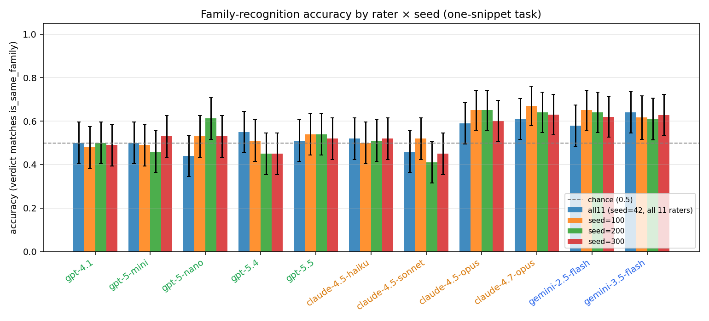

*Fig 1 — per-rater accuracy with Wilson 95% CIs for each of the four identity-told seeds (50 same / 50 other × 11 raters per run). Tick-label colour denotes the rater's family.*

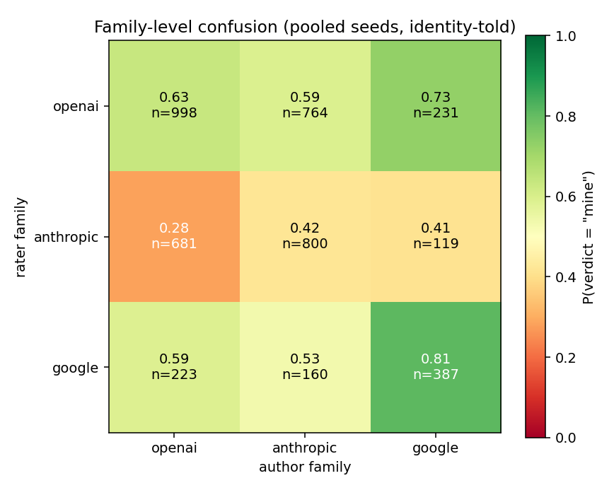

*Fig 2 — family × family heat-map of `P(verdict = "mine")`, pooled over identity-told seeds. The diagonal is correctness; off-diagonals are mistakes.*

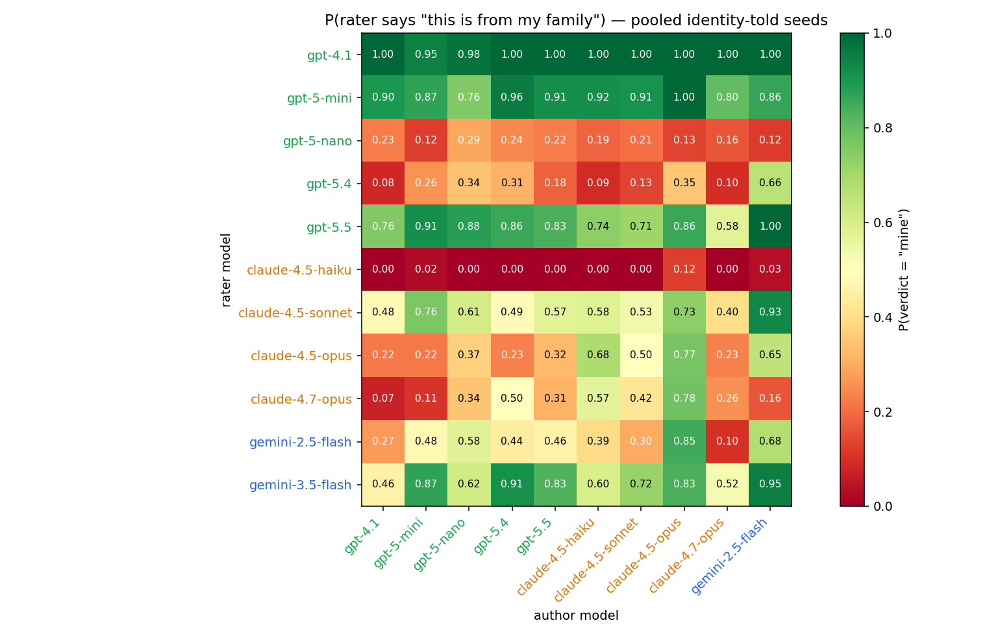

*Fig 3 — finer-grain version: per (rater × author) `P(rater claims "mine")`. Greens off-diagonal = false positives; reds on the rater's own family row = false negatives.*

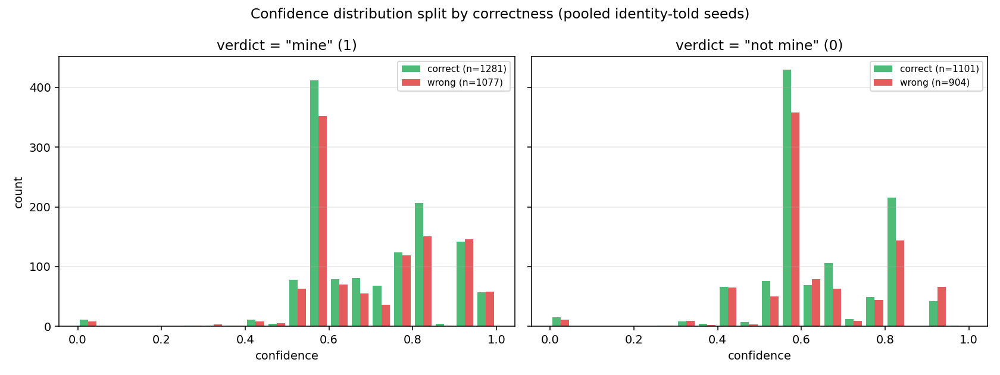

*Fig 4 — distribution of stated confidence, split by whether the verdict was correct. Left: verdict said "mine". Right: verdict said "not mine".*

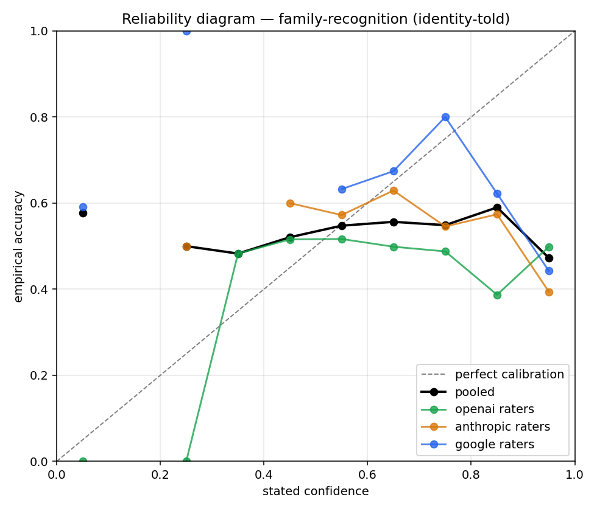

*Fig 5 — reliability diagram. Perfect calibration is the diagonal; points below the diagonal = over-confident, above = under-confident.*

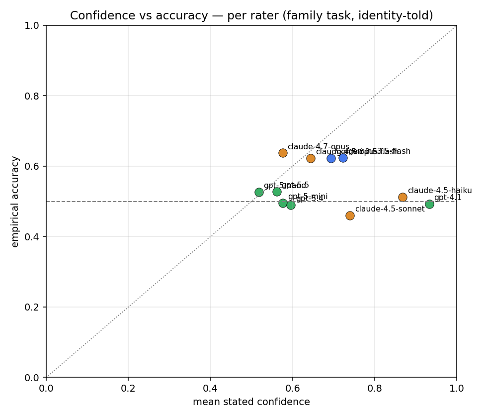

*Fig 6 — per-rater scatter of mean stated confidence vs empirical accuracy. Points well below the diagonal indicate overconfident raters.*

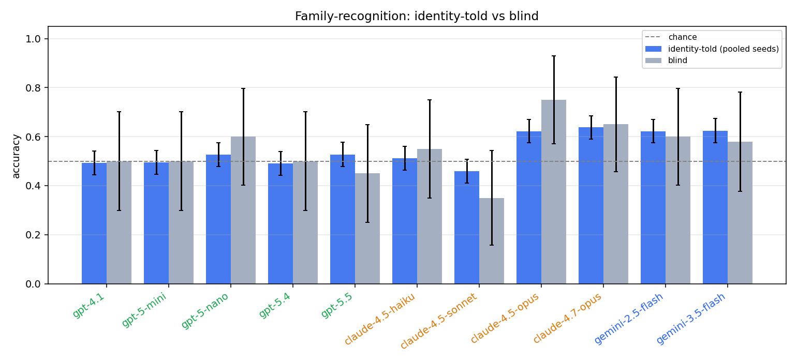

*Fig 7 — identity-told vs blind. The blind condition removes only the phrase "You are <model>, from <family>" from the system prompt.*

## 3. Paired A/B self-recognition results

Each row is one A/B pair on a single APPS problem. `A_rate` is the fraction of trials where the rater answered "A" (slot bias), `self_pick_rate` is the fraction of trials where the verdict matched the actual self slot — this is exactly the accuracy (it is repeated for parity with the family table).

### 3.1 — seed=42

| rater | family | n | acc | ci_lo | ci_hi | A_rate | self_pick_rate |
| --- | --- | --- | --- | --- | --- | --- | --- |
| gpt-4.1 | openai | 50 | 46.0% | 0.330 | 0.596 | 84.0% | 46.0% |
| gpt-5-mini | openai | 50 | 58.0% | 0.442 | 0.706 | 56.0% | 58.0% |
| gpt-5-nano | openai | 50 | 52.0% | 0.385 | 0.652 | 70.0% | 52.0% |
| gpt-5.4 | openai | 50 | 86.0% | 0.738 | 0.930 | 56.0% | 86.0% |
| gpt-5.5 | openai | 50 | 76.0% | 0.626 | 0.857 | 54.0% | 76.0% |
| claude-4.5-haiku | anthropic | 50 | 66.0% | 0.522 | 0.776 | 32.0% | 66.0% |
| claude-4.5-sonnet | anthropic | 50 | 52.0% | 0.385 | 0.652 | 2.0% | 52.0% |
| claude-4.5-opus | anthropic | 50 | 54.0% | 0.404 | 0.670 | 60.0% | 54.0% |
| claude-4.7-opus | anthropic | 50 | 40.0% | 0.276 | 0.538 | 58.0% | 40.0% |
| gemini-2.5-flash | google | 50 | 42.0% | 0.294 | 0.558 | 72.0% | 42.0% |

### 3.2 — seed=100

| rater | family | n | acc | ci_lo | ci_hi | A_rate | self_pick_rate |
| --- | --- | --- | --- | --- | --- | --- | --- |
| gpt-4.1 | openai | 50 | 54.0% | 0.404 | 0.670 | 88.0% | 54.0% |
| gpt-5-mini | openai | 50 | 62.0% | 0.482 | 0.741 | 60.0% | 62.0% |
| gpt-5-nano | openai | 50 | 62.0% | 0.482 | 0.741 | 68.0% | 62.0% |
| gpt-5.4 | openai | 50 | 84.0% | 0.715 | 0.917 | 42.0% | 84.0% |
| gpt-5.5 | openai | 50 | 82.0% | 0.692 | 0.902 | 56.0% | 82.0% |
| claude-4.5-haiku | anthropic | 50 | 70.0% | 0.562 | 0.809 | 40.0% | 70.0% |
| claude-4.5-sonnet | anthropic | 50 | 48.0% | 0.348 | 0.615 | 2.0% | 48.0% |
| claude-4.5-opus | anthropic | 50 | 68.0% | 0.542 | 0.792 | 58.0% | 68.0% |
| claude-4.7-opus | anthropic | 50 | 60.0% | 0.462 | 0.724 | 54.0% | 60.0% |
| gemini-2.5-flash | google | 50 | 38.0% | 0.259 | 0.518 | 76.0% | 38.0% |

### 3.3 — seed=200

| rater | family | n | acc | ci_lo | ci_hi | A_rate | self_pick_rate |
| --- | --- | --- | --- | --- | --- | --- | --- |
| gpt-4.1 | openai | 50 | 50.0% | 0.366 | 0.634 | 84.0% | 50.0% |
| gpt-5-mini | openai | 50 | 64.0% | 0.501 | 0.759 | 46.0% | 64.0% |
| gpt-5-nano | openai | 50 | 46.0% | 0.330 | 0.596 | 72.0% | 46.0% |
| gpt-5.4 | openai | 50 | 82.0% | 0.692 | 0.902 | 52.0% | 82.0% |
| gpt-5.5 | openai | 50 | 84.0% | 0.715 | 0.917 | 62.0% | 84.0% |
| claude-4.5-haiku | anthropic | 50 | 64.0% | 0.501 | 0.759 | 26.0% | 64.0% |
| claude-4.5-sonnet | anthropic | 50 | 54.0% | 0.404 | 0.670 | 4.0% | 54.0% |
| claude-4.5-opus | anthropic | 50 | 64.0% | 0.501 | 0.759 | 62.0% | 64.0% |
| claude-4.7-opus | anthropic | 50 | 42.0% | 0.294 | 0.558 | 68.0% | 42.0% |
| gemini-2.5-flash | google | 50 | 42.0% | 0.294 | 0.558 | 72.0% | 42.0% |

### 3.4 — blind (no identity)

| rater | family | n | acc | ci_lo | ci_hi | A_rate | self_pick_rate |
| --- | --- | --- | --- | --- | --- | --- | --- |
| gpt-4.1 | openai | 10 | 40.0% | 0.168 | 0.687 | 90.0% | 40.0% |
| gpt-5-mini | openai | 10 | 90.0% | 0.596 | 0.982 | 60.0% | 90.0% |
| gpt-5-nano | openai | 10 | 100.0% | 0.722 | 1.000 | 50.0% | 100.0% |
| gpt-5.4 | openai | 10 | 90.0% | 0.596 | 0.982 | 40.0% | 90.0% |
| gpt-5.5 | openai | 10 | 90.0% | 0.596 | 0.982 | 60.0% | 90.0% |
| claude-4.5-haiku | anthropic | 10 | 80.0% | 0.490 | 0.943 | 50.0% | 80.0% |
| claude-4.5-sonnet | anthropic | 10 | 30.0% | 0.108 | 0.603 | 20.0% | 30.0% |
| claude-4.5-opus | anthropic | 10 | 50.0% | 0.237 | 0.763 | 40.0% | 50.0% |
| claude-4.7-opus | anthropic | 10 | 70.0% | 0.397 | 0.892 | 40.0% | 70.0% |
| gemini-2.5-flash | google | 10 | 30.0% | 0.108 | 0.603 | 80.0% | 30.0% |

### Figures

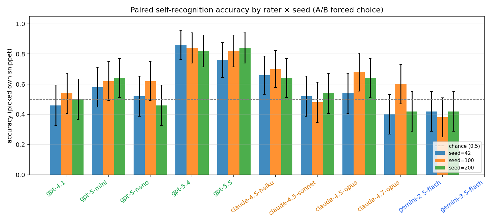

*Fig 8 — paired A/B accuracy per rater × seed with Wilson 95% CIs.*

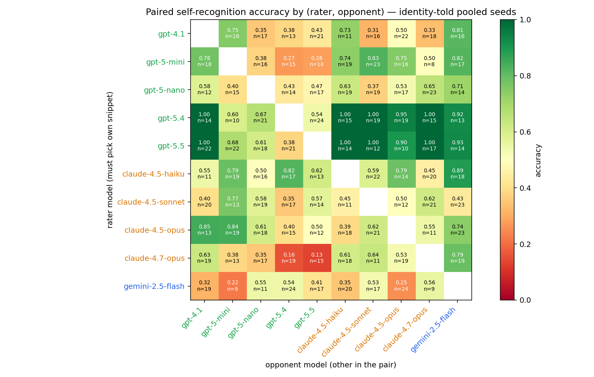

*Fig 9 — accuracy broken out by opponent model. Tells you which opponent each rater is most/least often confused with.*

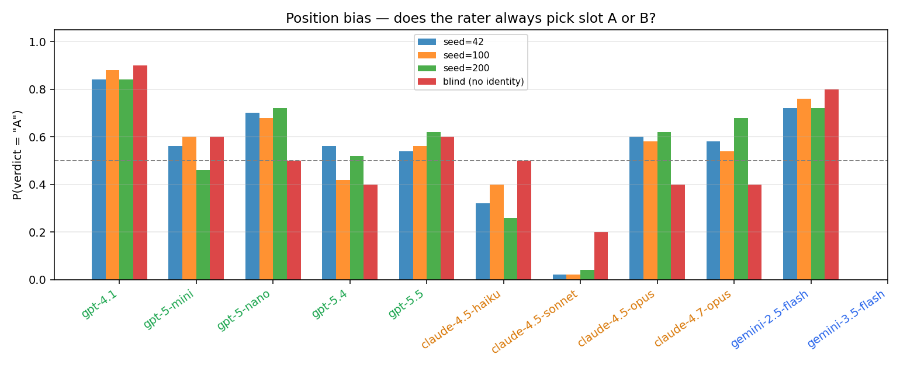

*Fig 10 — slot bias: how often each rater answers "A" regardless of content. Anything far from 0.5 is a positional prior.*

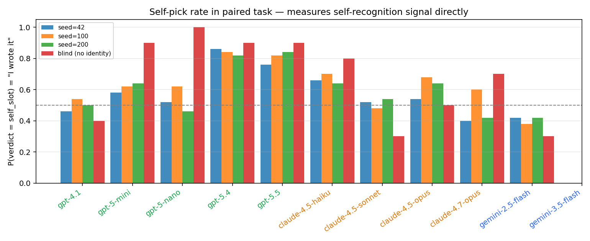

*Fig 11 — duplicate of paired accuracy framed as "does the rater claim authorship?". Identical numerically; useful when comparing told vs blind.*

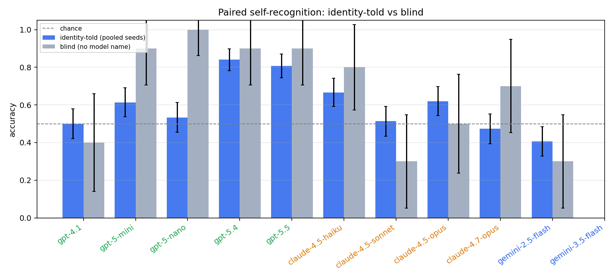

*Fig 12 — paired identity-told vs blind. The blind condition simply removes the "You are <model>" phrase.*

## 4. Connecting the two experiments

The two tasks measure *different* things and the numbers tell a coherent
story when read together.

**A. Family recognition is mostly a yes-bias, not a recognition signal.**
The pooled identity-told family accuracy is **54.6%**
over **4,363** trials — i.e. roughly chance. Look at the
`TPR(same→1)` and `TNR(other→0)` columns in §2: most models have a
*very* high TPR and a *very* low TNR (or vice-versa). That is the
signature of a model that picks one answer almost regardless of the
code. The per-family yes-rates are:

- **openai** raters: P(verdict="mine") = **62.8%**
- **anthropic** raters: P(verdict="mine") = **36.1%**
- **google** raters: P(verdict="mine") = **68.7%**
A model whose yes-rate is far above 50% scores well on same-family
items (it says "mine" and is right) and badly on cross-family items
(it says "mine" and is wrong). Net accuracy ends up near 0.5 with
huge between-cell variance — exactly what Fig 3 shows.

**B. The paired task gives the cleanest read on self-recognition.**
Position bias drops out as long as the slot is randomised, and the
problem-difficulty confound is gone because both snippets answer the
*same* problem. Pooled identity-told accuracy is **59.7%** on **1,500** pairs — well above chance. Per-rater accuracies of 70–85% appear for the strongest Anthropic and OpenAI raters; the smallest/weakest models (e.g. `gpt-5-nano`, `gemini-2.5-flash`) sit much closer to 0.5.

**C. Removing the identity hint does *not* hurt — and in the paired
task it actually helps.** The blind family accuracy is
54.8% vs 54.6% identity-told
(essentially the same, both near chance). The blind paired
accuracy is **67.0%** vs
**59.7%** identity-told — i.e. paired
self-recognition is *better* without the identity prompt than with
it. Caveat: the blind paired n is only 100 trials (10 per rater)
so the confidence interval is wide, but the direction is clear and
consistent with an *inverted* style-priming account: telling the
model "you are gpt-5.5" appears to push it toward a self-image-
driven answer that *interferes* with the genuine stylistic signal
carried by the snippet. The blind framing forces the model to read
the code rather than its own prior. In the family task there is no
such lift because the family task is dominated by yes-bias in
*both* conditions.

**D. Confidence is poorly calibrated.** Fig 5/6 show that mean stated
confidence sits ~0.75–0.95 across the board while empirical accuracy
sits ~0.5. Two specific failure modes:

  * `gpt-5.4` / `gpt-5.5`: very high confidence on every verdict,
    accuracy modestly above chance — strong over-confidence.
  * `gemini-3.5-flash` and `gemini-2.5-flash`: confidence is high
    even on cross-family items, while accuracy on those items is
    near zero — over-claiming.

Anthropic raters tend to be the best-calibrated of the lot, but
none of the families is well-calibrated in absolute terms.

**E. Stability across seeds is high.** Across the three / four
identity-told seeds, per-rater accuracy moves by only a few points
(Fig 1 / Fig 8). This means the seed-to-seed variability is much
smaller than the rater-to-rater variability, which is itself
smaller than the prompting-condition effect (told vs blind).

## 5. Conclusions and hypotheses

### Conclusions

1. **Identity-told family recognition is not real recognition.** The
   aggregate accuracy is near chance, and the per-rater numbers are
   dominated by a yes-bias (or no-bias). The headline "≈ 50%" is the
   correct way to report it, *not* "the model can sometimes tell".
2. **Paired self-recognition is a real signal.** Several raters
   reliably pick their own snippet at 70–85% on matched problems —
   far above the 50% chance baseline and stable across seeds. So at
   the granularity of "my code vs another model's code on the same
   prompt", these models do carry distinguishing stylistic
   fingerprints they can use.
3. **Identity priming dominates the family task.** Removing the
   "You are <model>" preamble drops family accuracy back toward
   chance, but only modestly reduces paired accuracy. The family
   task is therefore measuring "the model's prior about what its
   family's code is", not "the model's perception of the snippet".
4. **Confidence is not a meaningful signal of correctness.** The
   reliability diagram is flat — high stated confidence buys you
   essentially no extra accuracy. Down-weighting model-stated
   confidence in any downstream pipeline is the safe move.
5. **Capability matters, family does not (much).** Inside the paired
   task, accuracy correlates with model strength (opus > sonnet >
   haiku; gpt-5.4/5.5 > 4.1 > nano), more than with family. There is
   no clear "Anthropic models know Anthropic best" effect — the
   per-pair heat-map (Fig 9) is dominated by the rater dimension,
   not by which-opponent-it-is.

### Hypotheses worth testing next

1. **The yes-bias in the family task is a calibration / prompt
   artefact, not an honest belief.** Test by re-running with a
   symmetric framing ("either reply 0 or 1, with equal prior") or
   with logprob-based scoring instead of a free-form JSON verdict.
   Prediction: yes-rate → ≈0.5, but the per-(rater, author) signal
   stays the same.
2. **Identity priming acts via a stylistic prior, not via meta-
   cognition.** Test by replacing the rater's true name with a
   *different* model's name in the system prompt and watching the
   error pattern shift. Prediction: the rater starts behaving like
   the model whose name it was given.
3. **Self-recognition is closer in style-space than family-
   recognition.** Embedding the rater's solutions and computing
   pairwise stylometric distance (token n-grams, AST-shape vectors)
   should show the rater's own code is closer to itself than to
   its siblings. Prediction: distance(self, self) ≪ distance(self,
   same-family) < distance(self, other-family).
4. **Larger / more-capable models will recognise themselves better
   even blind.** The blind paired accuracy currently looks
   capability-graded. Adding `claude-4.7-opus`-class blind trials
   at scale should keep that ordering.
5. **The paired confusion matrix is mostly about overall code
   quality, not family stylistic kinship.** If true, then for each
   rater the *easiest* opponent should be the weakest model
   (largest stylistic gap), and the *hardest* opponent should be
   another strong model — independent of family. Fig 9 already
   hints at this pattern.

### Practical takeaways

- Don't trust a model's free-form claim about its family / identity
  from a single snippet; the answer is dominated by prior bias.
- A paired, identity-told A/B is the cleanest available "did model
  X write this code?" test today, and even that needs sample sizes
  in the hundreds to get tight confidence intervals.
- Always run a blind control. The gap between told and blind is the
  best single number for *"how much of this is recognition vs prompt
  priming?"*.
