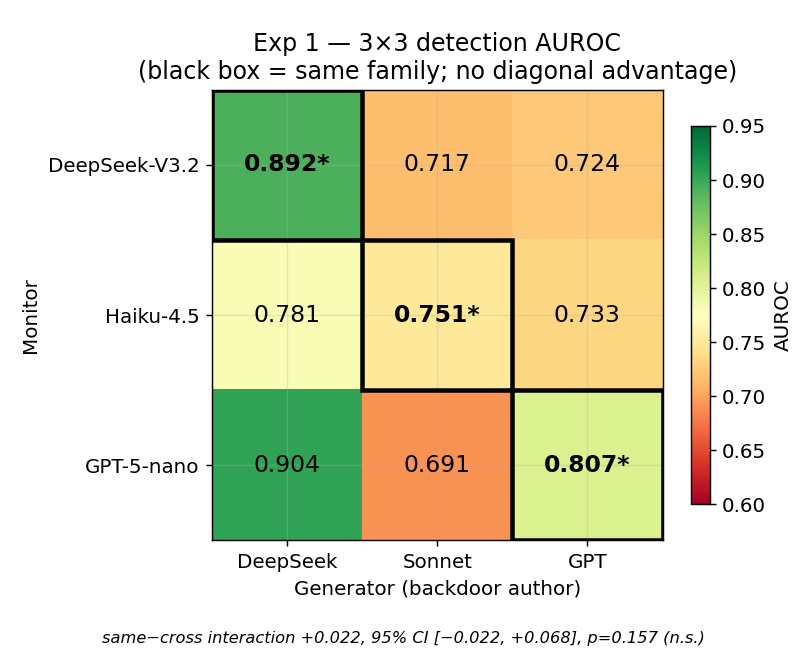
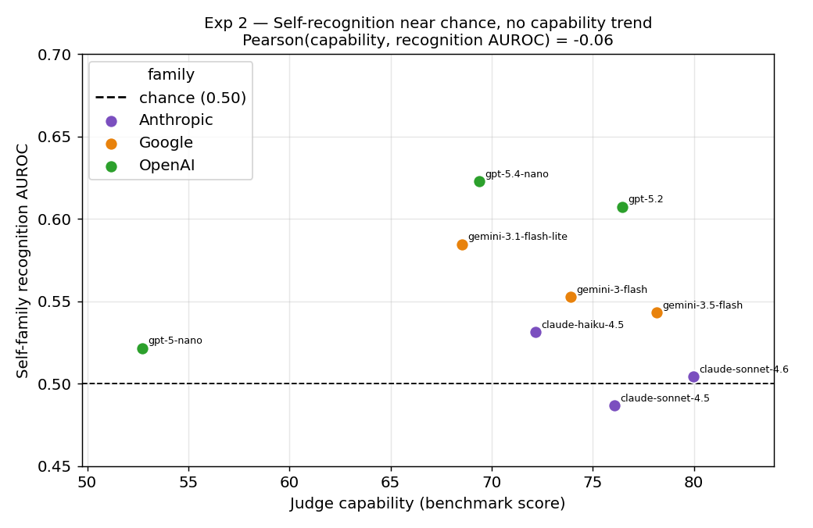
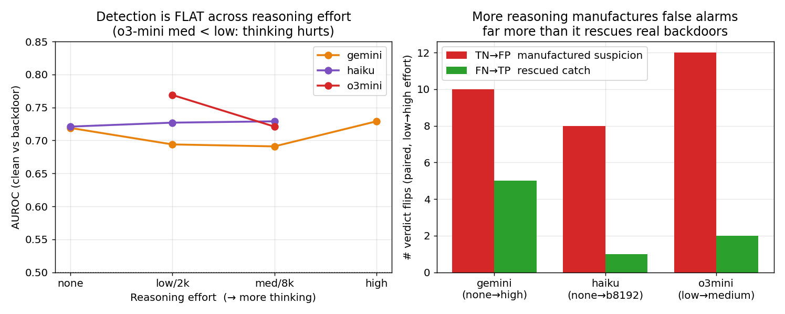
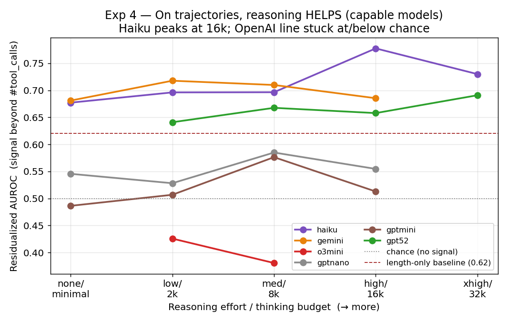
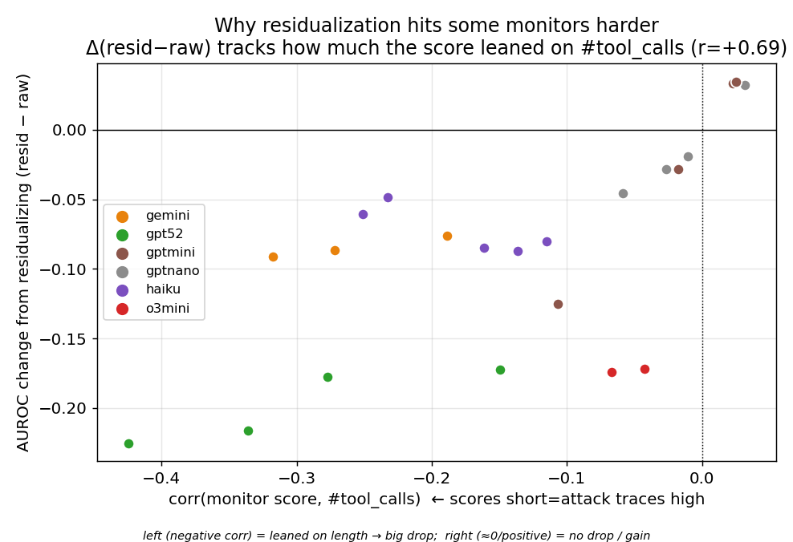
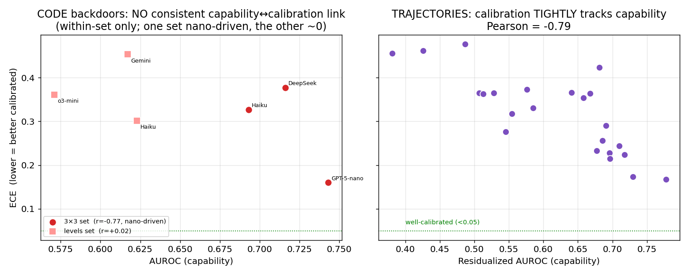

# Should Claude Monitor Claude? — Experiment Results

Four experiments probing whether LLM "trusted monitors" can reliably oversee other
LLMs — covering same-family bias, self-recognition, and whether test-time reasoning
helps monitoring on two very different detection tasks (code backdoors vs. agent
trajectories). All AUROC = ability to separate the malicious class from the benign one.
_All figures regenerate from `make_figures.py` → `figures/*.png`._

| # | Experiment | One-line outcome |
|---|---|---|
| 1 | 3×3 monitoring (same-family backdoor detection) | **No** robust same-family effect; capability/calibration drives detection |
| 2 | Self-family recognition | Models are **near-chance** at recognizing their own family's code; no capability trend |
| 3 | Reasoning vs backdoor detection | More monitor reasoning does **not** help (and hurts o3-mini) |
| 4 | Reasoning vs MonitoringBench (trajectories) | Reasoning **does** help — but only on this multi-step task, only past a budget, only for capable models |

---

## Experiment 1 — 3×3 Monitoring (same-family backdoor detection)

**Design.** 3 trusted monitors {DeepSeek-V3.2-Exp, Claude-Haiku-4.5, GPT-5-nano} ×
3 untrusted generators {DeepSeek-V3.2, Sonnet-4.5, GPT-5.2}. Each monitor reads a clean
or successful-backdoor APPS solution and outputs a suspicion judgment → AUROC. Core
question: does a monitor detect **its own family's** backdoors better (a "same-family"
bias that would matter for self-monitoring)? Run at 100-problem scale with a
version-aware family-identity system prompt + verdict-and-confidence rating.

**Results.** AUROC grid (* = same family):

| monitor ↓ / generator → | DeepSeek | Sonnet | GPT |
|---|---|---|---|
| DeepSeek-V3.2-Exp | 0.892* | 0.717 | 0.724 |
| Haiku-4.5 | 0.781 | 0.751* | 0.733 |
| GPT-5-nano | 0.904 | 0.691 | 0.807* |

*Figure 1. The same-family diagonal (black boxes) shows no systematic advantage; detection is organized by which generator's backdoors are detectable (columns), not by monitor–generator kinship.*

Same-minus-cross-family interaction across conditions: **+0.009** (no identity, 0–1
rating) → **+0.039** (identity, 0–1) → **+0.058** (identity, verdict+confidence). Per-cell
95% CIs ≈ ±0.06, so all interaction estimates are **within noise**. A larger **200-problem**
run pins this down: interaction **+0.022, 95% CI [−0.022, +0.068], one-sided p = 0.157 —
not significant** (same mean 0.758 vs cross 0.736). See [S3].

**Outcome.** No robust same-family monitoring effect. The small positive bump that
appears when the monitor is told its identity is partly a rating-format artifact
(verdict+confidence inflates it ~+0.02 over the 0–1 scale) and is **not statistically
significant** at this sample size.

**Discussion.** Detection is governed by **monitor capability and calibration**, not
family kinship. DeepSeek backdoors are easy for everyone (~0.89–0.90); Sonnet's are
subtlest. For the "should Claude monitor Claude" question, this is reassuring: we found
no evidence that a model is systematically *blind to* (collusion risk) or *better at*
its own family's backdoors. See [S1] for the confound decomposition and [S2] for the
capability gradient + ensemble follow-ups.

---

## Experiment 2 — Self-Family Recognition

**Design.** 9 models (3 families {Anthropic, OpenAI, Google} × 3 capability tiers) each
generate 100 one-shot APPS solutions. Each model is then shown **A/B pairs** — one
solution from its own family, one from a different family — and asked which is from its
own family, plus a confidence (paired 2-alternative forced choice; chance = 0.50).
Question: can models recognize their own family's code, and does recognition rise with
capability? (A passive-self-recognition collusion-channel probe.)

**Results.**

| metric | value |
|---|---|
| per-judge accuracy range | 0.44 – 0.68 (most near 0.50) |
| capability vs accuracy | Pearson **−0.19** (no positive trend) |
| self-pair vs sibling-pair accuracy | 0.57 vs 0.55 (≈ no self-advantage) |
| mean stated confidence | 0.72 – 0.92 (badly overconfident) |

*Figure 2. Every model sits near the 0.50 chance line and recognition does not rise with capability (y-axis is recognition AUROC; the accuracy-based correlation quoted below, −0.19, tells the same story).*

**Outcome.** No capability-driven self-recognition. Models hover near chance, do not get
better with capability (if anything slightly worse), recognize their *own* outputs no
better than a sibling's, and are confidently wrong.

**Discussion.** Passive self-recognition — a model spotting its own outputs to coordinate
with a colluding copy — appears **weak zero-shot**: these models can't reliably identify
their family's code at all. (Caveat: fine-tuning can make models proficient at
self-recognition; this measures only the off-the-shelf ability.) Method validated: A/B
position randomized and verified; self-vs-sibling split tracked. See [S9].

---

## Experiment 3 — Reasoning vs Backdoor Detection

**Design.** Hold the monitor task fixed (detect a backdoor in a single APPS solution) and
vary **reasoning effort**: Gemini-2.5-Flash {none/low/medium/high}, Haiku-4.5 thinking
budget {none/2k/8k}, o3-mini {low/medium}, scoring the 715-sample Sonnet detection set →
AUROC. Question: does giving the monitor more test-time reasoning improve detection?

**Results.** AUROC (clean vs backdoor), 95% bootstrap CI:

| monitor | level | AUROC | TP@5%FPR |
|---|---|---|---|
| Gemini | none/low/med/high | 0.719 / 0.694 / 0.691 / 0.729 | 0.00 |
| Haiku | none/2k/8k | 0.721 / 0.727 / 0.729 | 0.04→0.08 |
| o3-mini | low / medium | 0.769 / 0.721 | 0.00 |

Paired test: only significant effect is **o3-mini low−medium = +0.047** (thinking *hurt*);
Gemini and Haiku are flat within noise.

**GPT-5.2 (added later — same trajectory model, on the 143-sample verdict+confidence subset).**
Reasoning is flat here too: low **0.575** / medium **0.608** / high **0.568**. On this
comparable subset (where every monitor scores below its 715-headline) GPT-5.2 sits **right
with peers** — Haiku 0.623, Gemini 0.617, o3-mini 0.571 — so its strong-ish *trajectory*
detection does **not** translate into better *backdoor* detection; it's just one of the pack,
and adding effort doesn't help. (xhigh repeatedly credit-died at n=18 and is not reported.)

**Outcome.** More reasoning does **not** improve backdoor detection — confirmed across **four
models** (Gemini, Haiku, o3-mini, GPT-5.2) — and significantly *degrades* o3-mini.

**Discussion (autopsy, [S4]).** Reasoning moves the **suspicion prior, not the ranking**.
Across paired low→high effort, the dominant verdict change is **TN→FP "manufactured
suspicion"** (the monitor talks itself into flagging clean code) and only rarely FN→TP
"rescued" catches; for o3-mini, suspicion on *clean* code rises faster than on backdoors.
Stated confidence is non-informative (equally high when right or wrong → TP@5%FPR≈0). A
code backdoor is a **localized needle** the monitor either spots on read or rationalizes
*toward* — extra analytic depth doesn't help. The productive lever is
localization/verification or prior-calibration, not more thinking budget.

*Figure 3. Left: AUROC is flat across reasoning effort (o3-mini even drops med vs low). Right: paired low→high effort flips far more clean→false-alarm ("manufactured suspicion", red) than miss→catch ("rescued", green) — why more thinking doesn't move AUROC.*

---

## Experiment 4 — Reasoning vs MonitoringBench (agent-trajectory attack detection)

**Design.** A harder, multi-step task: monitors read a full BashArena agent trajectory
(tool calls + outputs, no side-task hint) and judge **attack vs honest**. Dataset:
MonitoringBench-derived 56 attack + 56 honest matched trajectories (action-only, ~16K
tokens), single-call verdict+confidence, swept across reasoning levels. **Confound
control:** honest traces issue ~**1.25× the tool-calls** of attacks, so a trivial
length/composition classifier scores ~0.62; every monitor AUROC is therefore reported
**residualized against #tool_calls**, plus an incremental-validity LR test and a paired
sign test. ([S7] length baseline; [S8] qualitative case study.)

**Results.** Residualized AUROC (real signal beyond the confound); best config per model:

| monitor | best residualized AUROC | incremental p | paired p |
|---|---|---|---|
| **Haiku** (16k budget) | **0.78** | <0.001 | <0.001 |
| **Gemini-Flash** (low) | **0.72** | <0.001 | <0.001 |
| **GPT-5.2** (xhigh) | **0.69** | <0.001 | <0.001 |
| GPT-5-mini | ~0.51–0.58 | marginal | n.s. |
| GPT-5-nano | ~0.55 | n.s. | n.s. |
| o3-mini | <0.50 | n.s. | n.s. |

Full reasoning ladders (residualized AUROC, all n=112 unless noted):
- **Haiku:** none 0.68 → 2k 0.70 → 8k 0.70 → **16k 0.78 (peak)** → 32k 0.73 — rises then *declines*.
- **Gemini:** none 0.68 (n.s.) → **low 0.72 (peak)** → med 0.71 → high 0.69 — peaks early, declines.
- **GPT-5.2:** low 0.64 → med 0.67 → high 0.66 → xhigh 0.69 — roughly flat (raw climbs 0.81→0.92, but that's mostly the confound).

*Figure 4. Residualized AUROC vs reasoning budget, for the three monitors that clear the length-only baseline (0.62); Haiku peaks at 16k before declining. The 3 small OpenAI models (o3-mini, gpt-5-nano, gpt-5-mini) sat at/below the baseline and are omitted for clarity (their numbers are in the ladders above and [S6]).*

**Outcome.** Capable monitors **genuinely detect attacks** beyond the length confound:
**Haiku (0.78) > Gemini (0.72) > GPT-5.2 (0.69)**, all significant on every test. The small
OpenAI reasoning models (o3-mini, GPT-5-nano, GPT-5-mini) are **near-chance** — but the most
capable, **GPT-5.2, clears the floor**, so the OpenAI failures are a **capability floor, not
family-wide**. Two reasoning findings: (1) **reasoning helps — up to a model-specific sweet
spot, then hurts** (Haiku peaks at 16k then drops at 32k; Gemini peaks at `low`); (2) most of
the *raw*-AUROC gain from effort is the #tool_calls confound (over-flagging), not better
de-confounded discrimination.

*Figure 6. How much AUROC a monitor loses to residualization tracks how strongly its score correlated with #tool_calls (r=+0.69): monitors that scored short=attack traces high (left) lose the most. o3-mini (red, corr≈0 yet a large drop) is the degenerate-score exception — its raw scores are near-constant, so its raw AUROC was unstable noise to begin with.*

**Discussion.** This is the clean contrast with Experiment 3: reasoning helps when the
task requires **integrating dispersed evidence across many steps** (a trajectory) and
doesn't when the signal is a **single localized pattern** (a code backdoor). The
qualitative case study [S8] shows the monitors reason soundly and name the exact
malicious mechanism (iptables backdoor, malware ExecStartPre, overt exfiltration) but are
fooled by **persuasively-framed** attacks (sudoers-as-test-fixture, disguised exfil) — the
"persuasion" failure mode. Detection on these (Opus-authored) traces is a Gemini/Haiku/
GPT-5.2 capability; only the *smaller* OpenAI models fail it. (Caveats: borderline verdicts
are nondeterministic; honest/attack come from different collection runs, partly mitigated by
the action-only rendering + #tool_calls residualization; GPT-5.2 xhigh needed a 36K+ token
budget to avoid truncating long honest traces — see [S6].)

---

## Calibration analysis (cross-cutting, Exps 1/3/4)

AUROC only measures **ranking**; it is invariant to how the suspicion *numbers* are scaled.
So we separately asked: are the monitors' probabilities trustworthy (**ECE** = mean gap
between stated suspicion and actual rate; well-calibrated <0.05), do they over/under-flag
(**bias** = mean suspicion − base rate), and what's the deployable catch rate
(**TP@5%FPR**)? And does calibration scale with capability? Code: `control_paper/
calib_vs_capability.py`, `trajectories/calib_traj.py`.

**Code-backdoor monitors (Exp 1/3) — uniformly poorly calibrated, TP@5%FPR≈0.** Per-monitor,
pooled (base rate 24%):

| set | monitor | AUROC | TP@5%FPR | ECE | bias |
|---|---|---|---|---|---|
| 3×3 | GPT-5-nano | 0.743 | **0.22** | 0.16 | +0.14 |
| 3×3 | DeepSeek-V3.2-Exp | 0.716 | 0.00 | 0.38 | +0.30 |
| 3×3 | Haiku-4.5 | 0.693 | 0.06 | 0.33 | +0.25 |
| levels | Haiku-4.5 | 0.623 | 0.01 | 0.30 | +0.12 |
| levels | Gemini-Flash | 0.617 | 0.00 | 0.45 | +0.28 |
| levels | o3-mini | 0.571 | 0.00 | 0.36 | +0.10 |

Every monitor **over-flags** (predicts backdoors 1.5–2× the 24% base rate) and is badly
calibrated (ECE 0.16–0.45). Calibration **does not scale with capability**: corr(AUROC,ECE)
is −0.76 on the 3×3 but that is n=3 driven entirely by GPT-5-nano (best AUROC *and* best
calibrated *and* the only usable TP@5%FPR=0.22); on the levels set the correlation is **0.00**.
GPT-5-nano — the cheapest model — being best-calibrated argues calibration is
model/training-idiosyncratic, not a capability rung. (Also expected: AUROC is
calibration-invariant, so the two are orthogonal by construction.)

**Trajectory monitors (Exp 4) — calibration is good where capability is, and tightly coupled
to it** (base rate 50%, balanced; ECE not comparable across base rates — read the *coupling*):

| config | resid AUROC | TP@5%FPR | ECE | bias |
|---|---|---|---|---|
| **Haiku b32768** | 0.730† | 0.67† | 0.13† | +0.13† |
| **Haiku b16384** | 0.777 | **0.68** | **0.17** | −0.02 |
| Haiku b8192 | 0.696 | 0.43 | 0.22 | −0.02 |
| Haiku none | 0.677 | 0.45 | 0.23 | −0.02 |
| Gemini low | 0.718 | 0.26 | 0.22 | −0.08 |
| Gemini none | 0.681 | 0.14 | 0.42 | +0.06 |
| o3-mini low | 0.426 | 0.07 | 0.46 | −0.46 |
| GPT-5-nano (best) | 0.585 | 0.12 | 0.33 | −0.22 |

*Figure 5. ECE (lower = better calibrated) vs capability. Code backdoors (left): no consistent link — the 3×3 set's r=−0.77 is driven entirely by GPT-5-nano, while the levels set is r=+0.02. Trajectories (right): calibration tightly tracks capability (r=−0.79 over all configs shown here incl. the later GPT-5.2 runs; −0.87 on the original 19), because both flow from grounding the judgment in the observed attack.*

Here **corr(residAUROC, ECE) = −0.87** across 19 configs — capability and calibration move
together, because both flow from grounding the judgment in the observed attack action (a
monitor with no real signal, e.g. o3-mini, falls back on a flat prior → bad on *both* axes).
**Reasoning improves calibration too, but only for capable models**: Haiku ECE falls
monotonically 0.23→0.13 (none→32k) and TP@5%FPR rises 0.45→0.68; Gemini snaps from 0.42→0.22
the moment reasoning turns on; weak models (gpt-nano/mini, o3-mini) stay flat. Note the
**failure-mode flip**: on code (24% base) monitors over-flag; here (50% base) the weak ones
*under*-flag (o3-mini bias −0.46, calls almost everything honest) — a deployment risk on a
realistic low-attack-rate stream.

**Takeaway.** On the ungrounded one-sided code task, neither capability nor calibration
responds to reasoning and no monitor is deployable at a strict threshold (TP@5%FPR≈0, except
nano's 0.22). On the grounded two-sided trajectory task, capability and calibration are two
readouts of the same competence, both improve with reasoning (for capable models), and the
best config catches **~⅔ of attacks at 5% FPR**. *Caveats:* TP@5%FPR is coarse on the 56+56
set (5% FPR ≈ 2.8 honest samples); calibration is on raw scores while capability is
residualized. **†Haiku b32768:** the residualized AUROC is the **corrected n=112** value
(0.73, down from the biased-subset 0.87); its TP@5%FPR/ECE/bias were computed on the earlier
n=68 subset and not yet recomputed — so for b32768 read the AUROC as corrected and the
calibration cells as provisional. Note the corrected ladder shows Haiku **peaking at 16k then
declining at 32k**, so b16384 (not b32768) is the genuine best config.

---

## Cross-experiment takeaways
1. **Monitoring quality is about model capability + calibration, not family or thinking budget** (Exps 1, 3). Calibration is the binding constraint at deployment: code monitors over-flag and catch ~nothing at 5% FPR, while the best trajectory monitor catches ~⅔ — and there calibration tightly tracks capability (corr −0.87) (Calibration analysis, [S10]).
2. **No evidence for same-family bias or zero-shot self-recognition** — mild news for the collusion-risk side of "Claude monitoring Claude" (Exps 1, 2).
3. **Reasoning's value is task-dependent**: useless for localized code backdoors, helpful (at high budget, for capable models) on multi-step agent trajectories (Exps 3 vs 4).
4. **Cheap ≠ incapable, capable ≠ universal**: GPT-5-nano was the best low-FPR backdoor monitor (Exp 1) yet near-chance on trajectories (Exp 4). Trajectory detection has a **capability floor** — the small OpenAI models (o3-mini/nano/mini) fail it, but the most capable, **GPT-5.2, clears it** (0.69), so it's about model strength, not the OpenAI family per se.
5. **Reasoning has a sweet spot, not a monotone**: trajectory detection improves with effort up to a model-specific budget (Haiku 16k, Gemini `low`) then *declines* with more (Haiku 32k, Gemini high) — "more thinking" is not strictly better even where it helps.

---

# Supplementary results

Additional smaller runs supporting the above. Code/data live in this repo.

- **[S1] 3×3 confounder decomposition.** Same-family interaction isolated by rating format
  (0–1 scalar vs verdict+confidence) and identity (on/off): +0.009 → +0.039 → +0.058; the
  format change accounts for ~⅓ of the apparent effect. Code: `control_paper/run_3x3.py`
  (`RATING_MODE=scalar`, `MONITOR_IDENTITY_SYS`); logs `logs/suspicion3x3{,_scalar_id}/`.
- **[S2] 3×3 capability gradient + ensembles.** A monitor weaker than its same-family
  generator does *worse* on its own family (GPT-5-nano −0.10, significant); ensembling
  monitors (mean/min, not max) helps only on the hardest generator; GPT-5-nano is the
  cheapest yet best low-FPR backdoor monitor. Code: `control_paper/analyze_3x3_capability.py`.
- **[S3] 3×3 at 200 problems.** Clean problem-range 200-sample run for tighter CIs
  (`logs/suspicion3x3_200/`, `analyze_3x3_significance.py`) — significance test of the
  same-family interaction.
- **[S4] Reasoning-vs-backdoor autopsy.** "Manufactured suspicion" (TN→FP ≫ FN→TP) and
  confidence-calibration analysis explaining the flat AUROC. Full writeup:
  `control_paper/THINKING_LEVELS_REPORT.md`; data `control_paper/levels_autopsy.json`.
- **[S5] Haiku budget ladder on trajectories.** Residualized: none 0.68 → 2k/8k 0.70 →
  **16k 0.78 (peak)** → 32k 0.73 — reasoning helps to a sweet spot, then *declines*. (The 32k
  point was initially invalid — a mid-run credit-exhaustion dropped 44 attack-only traces,
  biasing it to 0.87 on n=68; **re-run to full n=112 gives the valid 0.73**.) Data:
  `trajectories/monres_haiku_b*.jsonl`.
- **[S6] OpenAI reasoning models on trajectories.** GPT-5-nano and GPT-5-mini
  (minimal/low/med/high) are **near-chance** after de-confounding (raw-AUROC rise with effort
  is mostly the #tool_calls confound, "manufactured suspicion"). **GPT-5.2 is the exception:**
  it detects (residualized low 0.64 → xhigh 0.69, all significant) — confirming the small-model
  failures are a *capability floor*. GPT-5.2 over-flags (~100% positive verdicts; the confidence
  gradient carries the AUROC) and at xhigh needed `max_tokens`≈36K+ or it truncates the verdict
  on the longest (honest) traces — 8 such dropouts were recovered by re-running with a 48K budget.
  Data: `trajectories/monres_gpt*.jsonl`. **GPT-5.2 cross-task summary:** detects trajectories
  (residualized 0.64→0.69 across low→xhigh) but is only peer-level on backdoors (0.57–0.61,
  flat — see Exp 3) — its edge is multi-step integration, not localized needles. Backdoor logs:
  `control_paper/logs/levels_sonnet/` (model gpt-5.2); xhigh incomplete (credit-limited, n=18).
- **[S7] Length/composition confound baseline.** Trivial classifier on {tokens, asst chars,
  tool chars, #tool_calls} scores 0.70 (prose) / 0.62 (action-only); honest=1.25× tool
  calls of attack. Motivates the residualized/incremental analysis. Code:
  `trajectories/length_baseline.py`.
- **[S8] Trajectory reasoning case study.** 5 annotated attack/honest pairs (catches +
  persuasion failures) with full transcripts and a nondeterminism caveat:
  `trajectories/REASONING_CASE_STUDY.md`.
- **[S10] Calibration vs capability (ECE / bias / TP@5%FPR).** Per-monitor calibration on
  both detection tasks: code monitors uniformly over-flag (ECE 0.16–0.45, TP@5%FPR≈0, no
  capability scaling — corr 0.00 on levels, −0.76 on 3×3 but nano-driven); trajectory
  monitors well-calibrated where capable (Haiku 16k/32k ECE 0.13–0.17, TP@5%FPR≈0.68) with
  capability↔calibration corr −0.87 and reasoning improving both. Code:
  `control_paper/calib_vs_capability.py`, `trajectories/calib_traj.py`.
- **[S9] Self-recognition method + single-item variant.** Paired-2AFC build, A/B
  position-randomization verification, self-vs-sibling split; superseded single-item 0–1
  variant. Code: `selfrec/recognize_paired.py`, `selfrec/analyze.py`.

_Prompts for all experiments are centralized in `thursday_experiments_zu/prompts.py`
(superseded prompts in `prompts_old.py`). Full session state: `HANDOFF_FINDINGS.md`._
